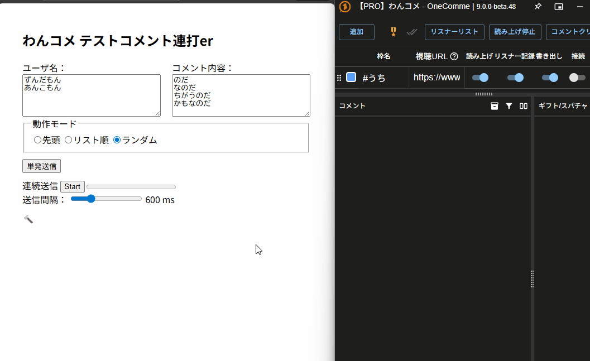

# onecomme_testrendaer
  
わんコメへのテストコメントを連打するから`renda`+`er`

## 概要
わんコメにテストコメントを連投する小ツールです  
ローカルにhtmlをダウンロードしてお使いください

このツールはlocalStorageに設定した値を保持します  
初期値に戻す場合は🔨からどうぞ  
ファイルのパスやファイル名が変わると以前の値を失います  
気になる場合は各ブラウザの設定から削除ください

## 注釈
- このファイルはわんコメと同じマシン上にダウンロードして動かすことを想定しています
- わんコメ 8.x系 9.x系 で動作を確認していますが  
  将来のバージョンではAPIの変更などにより動作しなくなる可能性があります

## ダウンロード方法
最新版は→のReleasesからzipをダウンロードし、任意の場所に解凍してください
https://github.com/Toukotsu/Onecomme_Testrendaer/releases

## 使い方
1. わんコメを起動
2. ブラウザで **testrendaer.html** を実行
3. `単発送信` か `連続送信` をpush

## つくったひと
[トウコツ](https://misskey.io/@toukotsu)

## ライセンス
[MIT](https://github.com/kotabrog/ft_mini_ls/blob/main/LICENSE)
